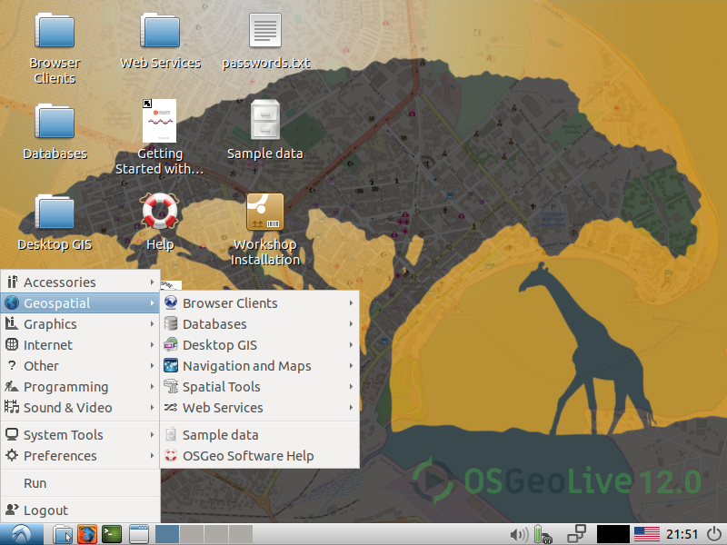
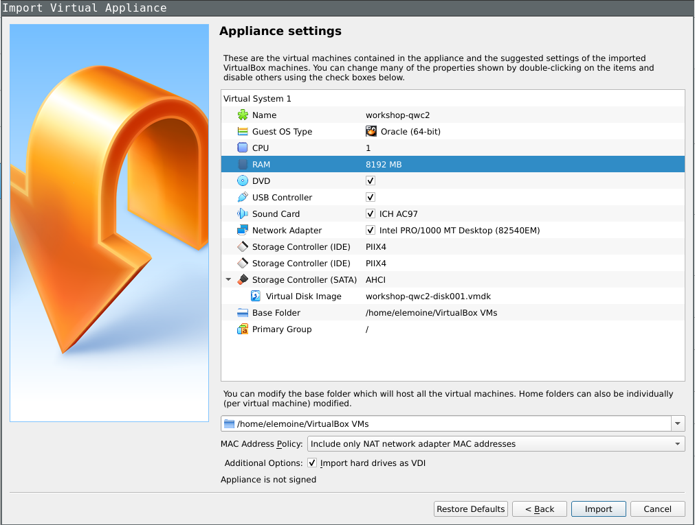
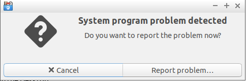
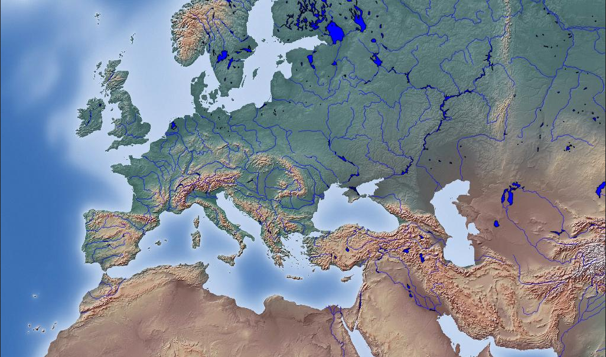
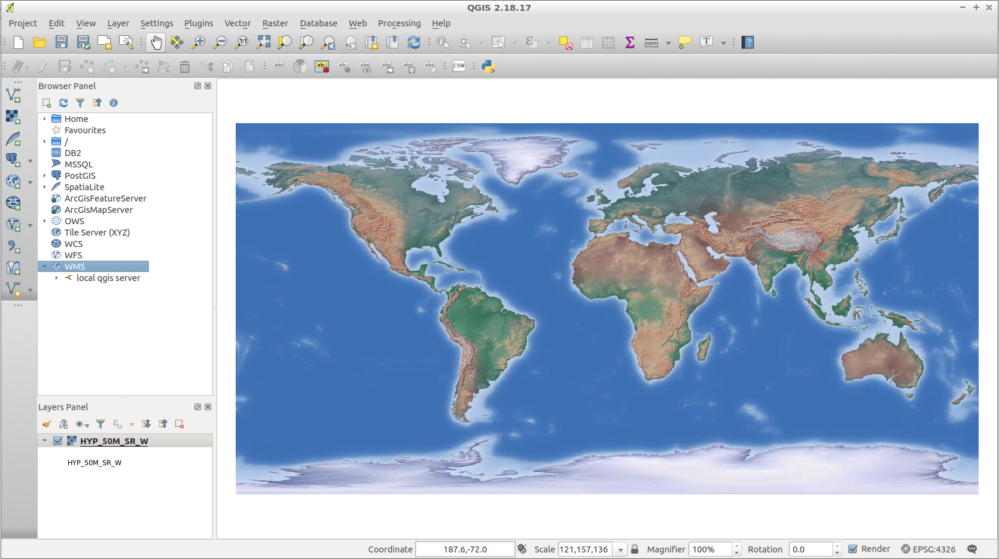
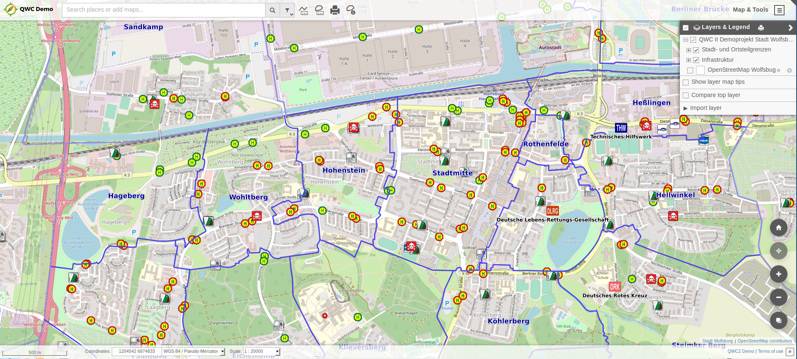
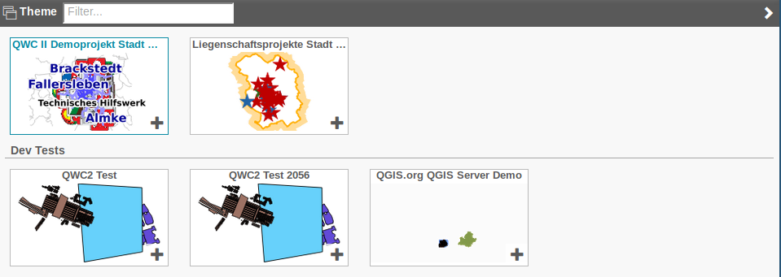
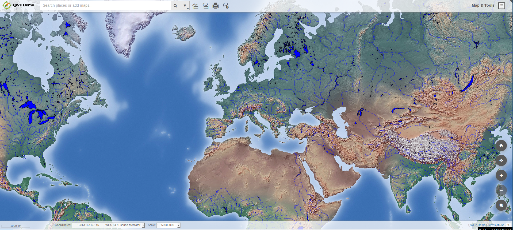
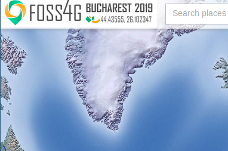

# Creating web-mapping applications with QGIS Server and QWC2


https://github.com/elemoine/workshop-qwc2/

## Éric Lemoine

* Oslandia
* eric -DOT- lemoine -AT- oslandia -DOT- com
* @erilem on Twitter

## Agenda

## Introduction

This workshop teaches about creating web-mapping applications with **QGIS Server** and **QGIS Web
Client 2** (a.k.a. QWC2).

### QGIS Server

* « Map Engine »
* Competitor to MapServer and GeoServer
* OGC Server
* Supports WMS, WFS and WMTS
* Uses the same rendering engine as QGIS Desktop
* Maps are created and designed with QGIS Desktop

QGIS Server doesn't have a User Interface. QGIS Server is a program that can respond to OGC
requests (WMS, WFS and WMTS).

Also it is to be noted that QGIS Server doesn't know about the HTTP protocol, so it is required to
run a web server, such as NGINX and Apache, to translate HTTP requests to CGI or FastCGI requests
that QGIS Server can handle. On that matter MapServer and QGIS Server work exactly the same way.

[QGIS Server Manual](https://docs.qgis.org/testing/en/docs/user_manual/working_with_ogc/server/index.html)

### QGIS Web Client 2

* A web client for QGIS Server
* Successor to QWC, with modern technologies (OpenLayers 3, React, Redux)
* Feature-rich
* Responsive
* Not just an application, but also a framework
* Flexible!

QWC2 can be seen as a User Inteface for displaying maps and map features served by QGIS Server.

[QWC2 Documentation](https://github.com/qgis/qwc2-demo-app/blob/master/doc/QWC2_Documentation.md)

Note: we, at Oslandia, have decided to use, and contribute to, QWC2 for our clients. We've
evaluated QWC2 as the simplest and most flexible web client for QGIS Server.

### This workshop

For this workshop you need to have [VirtualBox](https://www.virtualbox.org/) installed. VirtualBox
is used to run a Virtual Machine (VM) pre-installed with all the software necessary for this
workshop.

The workshop VM is based on [OSGeoLive](https://live.osgeo.org) version 12.0, itself based on
[Lubuntu](https://lubuntu.net/). OSGeoLive contains a collection of more than 50 pre-installed
OSGeo-related applications and librairies. OSGeoLive also includes sample data which we'll
use for the workshop.



Note: many thanks to the OSGeoLive developers and maintainers! OSGeoLive has become a very precious
resource in the OSGeo/FOSS4G world.

To create the workshop VM you need to import the virtual appliance `workshop-qwc2.ova` into
VirtualBox. For that please proceed with the following hands-on exercise.

**Hands-on exercise 1: start the VM**

First, copy the `workshop-qwc2.ova` file to the file system of your local machine.

Then you can you can optionally verify that the `workshop-qwc2.ova` file hasn't been
corrupted by checking its md5 sum. On Linux you can do it like this:

```shell
$ md5sum -c workshop-qwc2.ova.md5
```

Now launch the VirtualBox user interface and import the virtual appliance `workshop-qwc2.ova`. In
the "Appliance settings" window make sure you give enough RAM to the VM. 4096 MB should be enough,
but the more RAM the better. See the screenshot below.



With the appliance imported you are ready to start the virtual machine, so go for it!

Note: do not worry (too much) if you get the following error window. This error hasn't caused
any real problem so far.



## Discover the QGIS-Natural-Example project

OSGeoLive version 12 includes QGIS 2.18. And it includes two QGIS projects:
`QGIS-NaturalEarth-Example.qgs` and `QGIS-Itasca-Example.qgs`, both located in the
`/home/user/qgis-examples` directory.

We are going to use the `QGIS-NaturalEarth-Example.qgs` project in this workshop, which, as its name
suggests, relies on [Natural Earth](https://www.naturalearthdata.com/) data. The Natural Earth data
is stored as Shapefiles and TIF files in the `/home/user/data/natural_earth2` directory.

**Hands-on exercise 2: play with QGIS-NaturalEarth-Example QGIS project**

Start QGIS Desktop and open the `/home/user/qgis-examples/QGIS-NaturalEarth-Example.qgs` project.
Check that the map loads correctly and that all the layers display as expected.

Optionally you can change the styles of some layers, and save your changes. You can also change the
map projection to EPSG:3857 if you feel like so. EPSG:3857 is the projection we will use when
displaying the map in QWC2.

## Execute and test QGIS Server

### QGIS Server 2

As already mentioned OSGeoLive version 12 comes with QGIS 2.18. And both QGIS Desktop and QGIS
Server are installed.

QGIS Server 2.18 is managed by Apache and its `mod_fcgid` module. The communication between Apache
and QGIS Server 2.18 uses the FastCGI protocol.

Apache is configured to make QGIS Server 2.18 available at
`http://localhost/cgi-bin/qgis_mapserv.fcgi`.

**Hands-on exercise 3: issue WMS requests to QGIS Server**

Open http://localhost/cgi-bin/qgis_mapserv.fcgi in a browser window. You will get an error message
indicating that the Service is unknown or unsupported. This is because no service is specified in
the URL.

Open http://localhost/cgi-bin/qgis_mapserver.fcgi&SERVICE=WMS. You will now get an error
indicating that Operation is not supported. This is because no request is specified in the URL.

Now open http://localhost/cgi-bin/qgis_mapserv.fcgi?SERVICE=WMS&REQUEST=GetCapabilities. This
time you should get an XML document representing the capabilities of the WMS service. By default
the `QGIS-Itasca-Example.qgs` project is picked up. To specify the QGIS project to use the `MAP`
parameter can be used.

Open
http://localhost/cgi-bin/qgis_mapserv.fcgi?SERVICE=WMS&REQUEST=GetCapabilities&MAP=/usr/local/share/qgis/QGIS-NaturalEarth-Example.qgs
to view the WMS capabilities for the QGIS-NaturalEarth-Example project.

Note: `/usr/local/share/qgis` is used instead of `/home/user/qgis_examples` for the MAP parameter
value because QGIS Server doesn't follow symbolic links, and `/home/user/qgis_examples` is
a symbolic link to `/usr/local/share/qgis`.

You are now execute a WMS GetMap request and make QGIS Server generate a map, as a JPEG image.
Open<br>
http://localhost/cgi-bin/qgis_mapserv.fcgi?LAYERS=HYP_50M_SR_W,ne_10m_lakes,ne_10m_rivers_lake_centerlines&SERVICE=WMS&VERSION=1.1.1&REQUEST=GetMap&STYLES=&EXCEPTIONS=application/vnd.ogc.se_inimage&FORMAT=image/jpeg&SRS=EPSG%3A3857&BBOX=-2503464,2763262,8348470,9170832&WIDTH=1024&HEIGHT=605&MAP=/usr/local/share/qgis/QGIS-NaturalEarth-Example.qgs.

You should get the following image:



### QGIS Server 3

QGIS 2.18 is rather old, and QGIS Server has been greatly improved (and fixed!) in QGIS 3. So we're
going to use QGIS Server 3 in the rest of the workshop.

Let's first review the improvements brought by QGIS Server 3:

* Multi-thread rendering as in QGIS Desktop
* WFS 1.1 support
* Full Python bindings for the server API
* Server services as plugins
* OGC compliancy platform
* More unit tests
* And tons of fixes

The workshop VM has QGIS Server 3 pre-installed. It is installed as a Docker image. You can do
`docker images` in a console to verify that the `qgis-exec` Docker image is present. You should
also see the `nginx:1.13` image, which will be our web server for QGIS Server 3.

The Docker images are there, but no container is running for the moment. Starting the QGIS and the
NGINX containers will be done with the next exercise.

The QGIS Server Docker image (`qgis-exec`) was created using the
[docker-qgis](https://github.com/Oslandia/docker-qgis) project by Oslandia. This project offers two
Docker images: the `qgis-build` image for building QGIS Server, and the `qgis-exec` image for
executing QGIS Server. We just use the latter in this workshop.

**Hands-on exercise 4: run the QGIS Server 3 container**

The `qgis-exec` and `nginx` Docker images are already installed, and the VM includes a [Docker
Compose](https://docs.docker.com/compose/) file that makes it easy to start the containers.

Open a terminal and execute the following commands:

```shell
$ cd workshop-qwc2/docker-qgis/qgis-exec
$ ./venv/bin/docker-compose up  # start the nginx and qgis-exec containers
```

This is the last line you should see on the console:

```
qgis-exec_1  | 14:13:32 INFO Server[25]: No server python plugins are available
```

Do not worry about the Python error above this message. It's related to the Python plugin support
that's missing in this version.

QGIS Server should now be available at http://localhost:8080/qgis.

Note: you can do `Ctrl+C` in the console where you've executed `docker-compose up` to stop the
`qgis-exec` and `nginx` containers. And you can do `docker-compose up` again to start them again.

**Hands-on exercise 5: issues WMS requests to QGIS Server**

In this exercise you will repeat the requests of exercise 3.

Note: you don't need to have the `MAP` parameter in the requests here, as the QGIS project is preset
through the `QGIS_PROJECT_FILE` environment variable in the `docker-compose.yml` file.

For the impatients this the final WMS GetMap request:
<br>
http://localhost:8080/qgis?LAYERS=HYP_50M_SR_W,ne_10m_lakes,ne_10m_rivers_lake_centerlines&SERVICE=WMS&VERSION=1.1.1&REQUEST=GetMap&STYLES=&EXCEPTIONS=application/vnd.ogc.se_inimage&FORMAT=image/jpeg&SRS=EPSG%3A3857&BBOX=-2503464,2763262,8348470,9170832&WIDTH=1024&HEIGHT=605.

It should yield the same image as previously (with QGIS Server 2).

At this point we know that QGIS Server 3 is working correctly and is ready to serve maps to QWC2!

**Hands-on exercise 6: use QGIS Desktop as an OGC client (bonus)**

Open QGIS Desktop again, add a WMS Connection pointing to our QGIS Server 3 instance
(http://localhost:8080/qgis), and add a layer to the QGIS map from that WMS Connection.

Also known as "create maps in QGIS Desktop, serve them with QGIS Server, and use QGIS Desktop as an
OGC client to visualize them".



## Discover the QWC2 Demo App

In this section you're going to start the QWC2 Demo App, display it in your browser, and
learn about the features offered by QWC2.

But what's "QWC2 Demo App" by the way?

[QWC2](https://github.com/qgis/qwc2) is a collection of high-level JavaScript components built with
[OpenLayers](https://openlayers.org) and [React](https://reactjs.org/). These components can then be
assembled to form a complete web-mapping application. So QWC2 is a library targeted to web
developers rather than an application that you can just install.

And here comes with [QWC2 Demo App](https://github.com/qgis/qwc2-demo-app)! QWC2 Demo App is an
application built using QWC2 components. QWC2 Demo App uses a lot of QWC2 components, to effectively
demonstrate the capabilities of QWC2.

QWC2 Demo App is also an application that you can configure and tailor to your needs. So it is often
a good idea to start with QWC2 Demo App, and gradually customize it to meet your requirements. If
you're a developer you can even create and use your own React components.

This is what it looks like by default:



**Hands-on exercise 7: start and explore QWC2 Demo App**

QWC2 is already installed in the workshop VM, under `/home/user/workshop-qwc2/qwc2-demo-app`. Open
a new terminal, change to the `qwc2-demo-app` directory, and start the application:

```shell
$ cd workshop-qwc2/qwc2-demo-app
$ yarn start
```

The `yarn start` command actually launches a development server for the application. In production
context the application would be built, and the build artefacts would be served by a web server such
as NGINX or Apache. More on that later in the workshop…

Now is a good time to explore the QWC2 Demo App. Here are examples of things you can try out:

1. Open the "Theme" panel and change from one theme to another
1. Open the "Layers & Legend panel" and change the visibility of layers
1. Open the "Theme" panel again and select the QGIS.org QGIS Server Demo theme
1. Click on objects of the polygons layer to display information about the clicked objects
1. Open the "Switch background" panel and select another background layer
1. Enter "44.44,26.10" in the "Search places" field and select "26.1°E, 44.44°N"

You can also play with the Measure and Redlining tools if you feel like so.

## Add a new theme

Themes are an important notion of QWC2. A theme is basically a collection of layers. When you switch
themes you actually change the list of layers that can you can add/remove to/from the map through
the "Layers & Legend" panel.

A theme actually corresponds to a QGIS project. There are five themes in QWC2 Demo App by defaut,
each one corresponding to a different QGIS project served by a QGIS Server instance.



**Hands-on exercise 8: add a theme for QGIS-NaturalEarth-Example**

In this exercise you are going to add a new theme for the QGIS-NaturalEarth-Example project served
by the QGIS Server 3 instance you just set up.

Themes are configured in the `themesConfig.json` file at the root of the `qwc2-demo-app` directory.
Edit `themesConfig.json` using the LeafPad or vim editor, and take some time going over the file to
understand how themes are configured.

Then add a theme for QGIS-NaturalEarth-Example. You can for example add it to the "Dev Tests" group.
Or you can add the QGIS-NaturalEarth-Example theme, and remove all the other themes.

Here is a theme config that works:

```json
{
  "title": "QGIS Natural Earth",
  "url": "http://localhost:8080/qgis",
  "default": true,
  "scales": [50000000, 25000000.0, 12500000.0, 6250000.0, 3125000.0, 1562500.0,
             781250.0, 390625.0, 195312.5, 97656.25, 48828.125],
  "extent": [-9546172, -884033, 12504796, 12051177],
  "backgroundLayers": [
    {
      "name": "mapnik"
    }
  ],
  "mapCrs": "EPSG:3857",
  "searchProviders": ["coordinates"],
  "config": {
    "preserveExtentOnThemeSwitch": false
  }
}
```

For your changes to `themesConfig.json` to be taken into account the following `yarn` command should
be run:

```
$ yarn run themesconfig
```

You can also stop the development server by doing `Ctrl+C` in the console where `yarn start` was
executed, and execute `yarn start` to start the developement server again. But that will take a lot
more time than just executing `yarn run themesconfig` and reloading the web application in the
browser.

Note that you can also do `git checkout exercise8` to get the final version of `themesConfig.json`
without having to edit the `themesConfig.json` file by yourself.

Anyway this is what you should eventually see in your browser window:



You can now verify that the map behaves correctly, and that "map clicks" work for displaying
information about rivers and lakes for example.

## Customize the QWC2 app

With this section you are going to make a number of customizations to the QWC2 Demo App. Just
simple customizations that don't require writing any code.

**Hands-on exercise 9: change the logo and the theme thumbnail**

Let's first change the logo located in the top-left corner of the application.

Download the FOSS4G 2019 Bucharest logo from
https://2019.foss4g.org/wp-content/uploads/2018/07/logo-site.png and save it as
`assets/img/logo.png`. Now edit the `config.json` file and add `"logoFormat": "png"`
to the `TopBar` config after the setting of the `"logoUrl"` property:

```json
             "logoUrl": "/",
             "logoFormat": "png"
```

Now reload the application in the browser. You should see the new logo.



You may have noticed that the thumbnail image for the QGIS Natural Earth theme used in the Theme
panel is ugly. Let's change it by a specific image of our choice.

Create a thumbnail image for the QGIS Natural Earth theme using the following GetMap request:

http://localhost:8080/qgis?SERVICE=WMS&VERSION=1.3.0&REQUEST=GetMap&FORMAT=image%2Fpng&TRANSPARENT=true&LAYERS=HYP_50M_SR_W&STYLES=&SRS=EPSG%3A3857&CRS=EPSG%3A3857&TILED=false&DPI=96&OPACITIES=255%2C255%2C255&WIDTH=200&HEIGHT=100&BBOX=-7414947.916666666%2C-132291.6666666679%2C10378281.249999998%2C11297708.333333332

Save the image as `assets/img/mapthumbs/naturalearth.png`, and add `"thumbnail": "naturalearth.png"`
to the Natural Earth theme config in `themesConfig.json`:

```json
         "searchProviders": ["coordinates"],
         "thumbnail": "naturalearth.png"
```

And do not forget that changes to `themesConfig.json` require running the `yarn run themesconfig`
command.

Reload the application in the browser, and you should see the new theme thumbnail in the Theme
panel.

**Hands-on exercise 10: remove unneeded features**

Let's assume that we don't want to have the "Share" and "External link" functionalities. They can be
removed by deleting the corresponding configuration blocks from the `config.json` file.

Edit the `config.json` file and remove the following lines:

```json
{"key": "ExternalLink", "icon": "link", "url": "http://example.com?extent=$e$"}
```

```json
{"key": "Share", "icon": "share", "identifyEnabled": true},
```

Note: when deleting the `ExternalLink` line do not forget to remove the trailing coma from
the previous line. This is to keep the JSON file syntacticaly correct.

This "Customize the QWC2 app" section has just touched the surface of QWC2 Demo App customization.
You can a lot more, as explained in the [QWC2 Demo App
documentation](https://github.com/qgis/qwc2-demo-app/tree/master/doc).

## Build the QWC2 app for production

Up to now we have relied on QWC2 Demo App's development server. Although necessary during
development it is very slow, so you don't want to use it in production.

In production what you want to do is *build* the application and use your production web
server for serving the JS, CSS, and img files resulting from the build step.

**Hands-on exercise 11: build the application**

To build the application run the following yarn command:

```shell
$ yarn run prod
```

This command builds the application and stores the results under the `prod` directory. What's
left to be done is copying the content of the `prod` directory to a web-accessible directory.

In our case we're going to the NGINX we server, which is the web server we already use for
QGIS Server 3. So let's copy the content of the `prod` directory to the NGINX directory:

```
cp -r prod/* ../docker-qgis/qgis-exec/html/
```

Now open http://localhost:8080 in your browser to load the production version of your QWC2
application. Enjoy!
