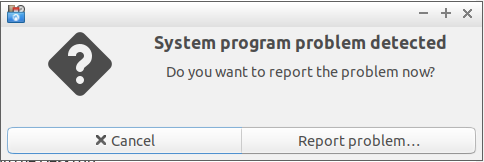

# Creating web-mapping applications with QGIS Server and QWC2


## Éric Lemoine

* Oslandia
* eric -DOT- lemoine -AT- oslandia -DOT- com
* @erilem on Twitter

## Agenda

## Introduction

This workshop teaches about creating web-mapping applications with **QGIS Server** and **QGIS Web
Client 2** (a.k.a. QWC2).

### QGIS Server

* « Map Engine »
* Competitor to MapServer and GeoServer
* OGC Server
* Supports WMS, WFS and WMTS
* Uses the same rendering engine as QGIS Desktop
* Maps are created and designed with QGIS Desktop

[QGIS Server Manual](https://docs.qgis.org/testing/en/docs/user_manual/working_with_ogc/server/index.html)

### QGIS Web Client 2

* A web client for QGIS Server
* Successor to QWC, with modern technologies (OpenLayers 3, React, Redux)
* Feature-rich
* Not just an application, but also a framework
* Flexible!

[QWC2 Documentation](https://github.com/qgis/qwc2-demo-app/blob/master/doc/QWC2_Documentation.md)

Note: we, at Oslandia, have decided to use, and contribute to, QWC2 for our clients. We've
evaluated QWC2 as the simplest and most flexible web client for QGIS Server.

### This workshop

For this workshop you need to have [VirtualBox](https://www.virtualbox.org/) installed. VirtualBox
is used to run a Virtual Machine (VM) pre-installed with all the software necessary for the
workshop.

The workshop VM is based on [OSGeoLive](https://live.osgeo.org) version 12.0, itself based on
[Lubuntu](https://lubuntu.net/). OSGeoLive contains a collection of more than 50 pre-installed
OSGeo-related applications and librairies. OSGeoLive also includes sample data which we'll
use for the workshop.


Note : many thanks to the OSGeoLive developers and maintainers! OSGeoLive has become a very
precious resource.

**Hands-on exercise 1: start the VM**

First, extract the `workshop-qwc2.ova` file from the `workshop-qwc2.ova.7z.00*` 7z volume files. On
Linux this can be done using the `7z` command as follows:

```shell
$ 7z x workshop-qwc2.ova.7z.001
```

On macOS you can use [The
Unarchiver](https://apps.apple.com/app/the-unarchiver/id425424353?ls=1&mt=12) app, which is
available on App Store. On Windows, [7-Zip](https://www.7-zip.org/) and
[WinRAR](https://www.win-rar.com/) are common tools to deal with 7z files.

Optionally you can now check that the resulting `workshop-qwc2.ova` file is not corrupted. On Linux
you can do it like this:

```shell
$ md5sum -c workshop-qwc2.ova.md5
```

Now launch the VirtualBox user interface and import the virtual appliance `workshop-qwc2.ova`. In
the "Appliance settings" window make sure you give enough RAM to the VM. 8196 MB should be enough.
See the screenshot below.


With the appliance imported you are ready to start the virtual machine, so go for it!

Note: do not worry (too much) if you get the following error window. This error hasn't caused
any real problem so far.



## Discover the QGIS-Natural-Example project

OSGeoLive version 12 includes QGIS 2.18. And it includes two QGIS projects:
`QGIS-NaturalEarth-Example.qgs` and `QGIS-Itasca-Example.qgs`, both located in the
`/home/user/qgis-examples` directory.

We are going to use the `QGIS-NaturalEarth-Example.qgs` project for the workshop, which, as its name
suggests, relies on [Natural Earth](https://www.naturalearthdata.com/) data. The Natural Earth data
stored as Shapefiles and TIF files in the `/home/user/data/natural_earth2` directory.

**Hands-on exercise 2: play with QGIS-NaturalEarth-Example QGIS project**

Start QGIS Desktop and open the `/home/user/qgis-examples/QGIS-NaturalEarth-Example.qgs` project.
Check that the map loads correctly and that all the layers display as expected.

Optionally you can change the styles of some layers, and save your changes. You can also change the
map projection to EPSG:3857 if you feel like so. EPSG:3857 is the projection we will use when
displaying the map in QWC2.

## Execute and test QGIS Server

As already mentioned OSGeoLive version 12 comes with QGIS 2.18. And both QGIS Desktop and QGIS
Server are installed.

QGIS Server 2.18 is managed by Apache and its `mod_fcgid` module. The communication between Apache
and QGIS Server 2.18 uses the FastCGI protocol.

Apache is configured to make QGIS Server 2.18 available at
`http://localhost/cgi-bin/qgis_mapserv.fcgi`.

**Hands-on exercise 3: issue WMS requests to QGIS Server**

Open `http://localhost/cgi-bin/qgis_mapserv.fcgi` in a browser window. You will get an error message
indicating that the Service is unknown or unsupported. This is because no service is specified in
the URL.

Open `http://localhost/cgi-bin/qgis_mapserver.fcgi&SERVICE=WMS`. You will now get an error
indicating that Operation is not supported. This is because no request is specified in the URL.

Now open `http://localhost/cgi-bin/qgis_mapserv.fcgi?SERVICE=WMS&REQUEST=GetCapabilities`. This
time you should get an XML document representing the capabilities of the WMS service. By default
the `QGIS-Itasca-Example.qgs` project is picked up. To specify the QGIS project to use the `MAP`
parameter can be used.

Open
`http://localhost/cgi-bin/qgis_mapserv.fcgi?SERVICE=WMS&REQUEST=GetCapabilities&MAP=/usr/local/share/qgis/QGIS-NaturalEarth-Example.qgs`
to view the WMS capabilities for the QGIS-NaturalEarth-Example project.

Note: `/usr/local/share/qgis` is used instead of `/home/user/qgis_examples` for the MAP parameter
value because QGIS Server doesn't follow symbolic links, and `/home/user/qgis_examples` is
a symbolic link to `/usr/local/share/qgis`.

## Install and use the QWC2 demo app

## Add a new map to the QWC2 app

## Customize the QWC2 app
